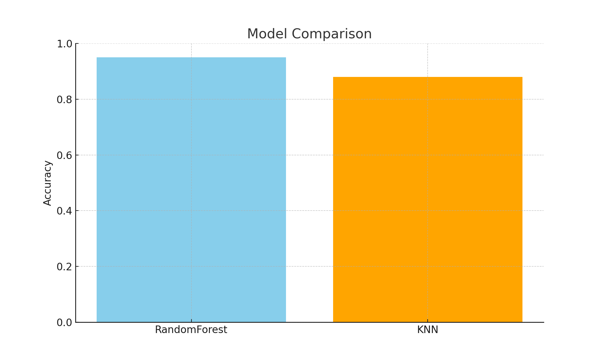

# Hand Gesture Recognition - Research Repository

This repository contains the research and experimentation phase of the Hand Gesture Recognition project, which uses hand landmark data collected from MediaPipe to classify gestures for controlling a maze game.

## 📚 Project Overview
The goal is to train and evaluate machine learning models on collected hand gesture data (e.g., left, right, up, down). These gestures will later be used to control a game.

## 🛠️ Approach
- Collected landmark data using MediaPipe and OpenCV.
- Trained multiple models (Random Forest, KNN) using Scikit-learn.
- Logged experiments and results using MLflow.
- Compared model performances based on accuracy.

## 🔬 Results and Model Comparison
| Model           | Accuracy |
|------------------|----------|
| RandomForest     | 0.95     |
| KNN              | 0.88     |

RandomForest was selected as the best-performing model due to its higher accuracy (95%) compared to KNN (88%). Additionally, RandomForest handles complex data patterns better, making it more suitable for real-time hand gesture recognition.

## 🏷️ Artifacts
- All MLflow logs, confusion matrices, and model files are collected in the `artifacts/` subfolder.

## 🚀 Next Steps
- Integrate the best model into the FastAPI backend.
- Deploy the complete system with Docker and AWS.
